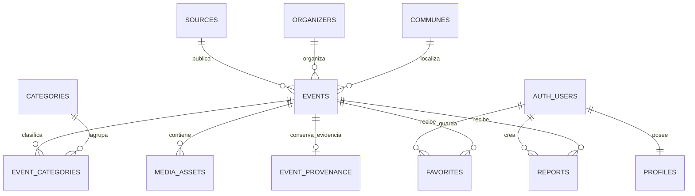

# Diccionario de datos · Eventos culturales de Chile

**Versión documentada:** 21 de septiembre de 2026  
**Esquema:** `public` de Supabase/PostgreSQL  
**Migraciones de referencia:** `supabase/migrations/20260831000100_initial_event_catalog.sql`,
`supabase/migrations/20260902000100_event_location_metadata.sql`,
`supabase/migrations/20260911000100_content_enrichment_and_organizer_controls.sql` y
`supabase/migrations/20260912000100_rewrite_state_and_reconciliation.sql`, además de
`supabase/migrations/20260921000100_atomic_catalog_publication.sql`.

Este documento describe la base de datos del MVP, el significado de sus tablas y columnas,
las relaciones, las políticas de acceso y la taxonomía observada. El boceto visual original se
utilizó solamente como referencia relacional; los campos de esta base provienen del modelo real
`Event` y de las necesidades operativas del recolector.

## 1. Vista general



`scrape_runs` registra la salud de cada sincronización y no necesita una clave foránea hacia
los eventos. Una ejecución puede descubrir cientos de eventos, pero los eventos permanecen
vigentes entre ejecuciones mediante sus identificadores deterministas.

### Tablas de ingesta y catálogo

| Tabla | Finalidad |
|---|---|
| `sources` | Agenda, municipalidad, ticketera o sitio desde el que se obtuvo la información. |
| `organizers` | Institución o entidad responsable de organizar el evento. |
| `communes` | Ubicación administrativa normalizada del evento. |
| `categories` | Etiquetas temáticas, de formato, audiencia o procedencia. |
| `events` | Registro canónico de cada evento consolidado. |
| `event_categories` | Relación muchos-a-muchos entre eventos y categorías. |
| `media_assets` | Imágenes y futuros videos, audios o documentos asociados. |
| `event_provenance` | Evidencia privada: texto original, OCR y URL canónica. |
| `scrape_runs` | Bitácora técnica de ejecuciones locales y de GitHub Actions. |
| `catalog_staging` | Fragmentos privados temporales usados para publicar un lote de forma atómica. |

### Tablas previstas para la aplicación

| Tabla | Finalidad |
|---|---|
| `profiles` | Perfil público mínimo asociado a Supabase Auth. |
| `favorites` | Eventos guardados por una persona autenticada. |
| `reports` | Avisos de usuarios sobre información incorrecta o problemática. |

## 2. Convenciones generales

- Todos los nombres usan `snake_case`.
- Las claves primarias son UUID. El scraper produce UUID v5 deterministas para el catálogo;
  repetir una extracción actualiza las mismas filas mediante `upsert`.
- `timestamptz` representa fecha y hora con zona horaria. Supabase la almacena internamente de
  forma normalizada y el cliente debe presentarla en `America/Santiago` cuando corresponda.
- Un valor `null` significa que la fuente no entregó el dato o que no pudo validarse. No debe
  interpretarse como una cadena vacía ni como `false`.
- `created_at` indica cuándo nació la fila; `updated_at`, su última modificación;
  `last_seen_at`, la última extracción en que el registro volvió a encontrarse.
- Las fechas textuales no interpretables, como “por confirmar”, descartan el evento antes de llamar
  a Supabase. Las fechas sin offset se localizan en `America/Santiago`. Si solo se conoce una fecha sin hora, PostgreSQL la recibe a medianoche;
  la versión actual todavía no posee un campo `is_all_day` para distinguir esos casos.
- `location` siempre contiene una etiqueta utilizable. `location_precision` evita confundir una
  región de respaldo con una dirección exacta y `location_source` registra cómo se obtuvo.
- La clave secreta de Supabase se utiliza únicamente en el scraper o en CI. Nunca pertenece al
  navegador, al frontend, al repositorio ni a los logs.

## 3. Diccionario de tablas y columnas

### `sources`

Catálogo de fuentes. Un registro representa el sitio o agenda de procedencia, no una página de
detalle individual.

| Columna | Tipo | Requisito | Significado |
|---|---|---|---|
| `id` | `uuid` | PK, obligatorio | UUID determinista derivado del nombre normalizado de la fuente. |
| `name` | `text` | Obligatorio, único sin distinguir mayúsculas | Nombre legible, por ejemplo `Chile Cultura`. |
| `website_url` | `text` | Opcional | Origen web principal, normalmente protocolo y dominio. |
| `is_active` | `boolean` | `true` por defecto | Indica si la fuente se considera activa para lectura pública. No activa ni desactiva el conector local. |
| `last_seen_at` | `timestamptz` | Opcional | Última carga en que la fuente aportó al menos un evento. |
| `created_at` | `timestamptz` | Automático | Momento de creación de la fila. |
| `updated_at` | `timestamptz` | Automático | Última actualización; mantenida por trigger. |

### `organizers`

Entidades que producen, convocan o gestionan eventos. Puede tratarse de una municipalidad,
corporación cultural, universidad, museo, productora u otra organización.

| Columna | Tipo | Requisito | Significado |
|---|---|---|---|
| `id` | `uuid` | PK, obligatorio | UUID determinista derivado del nombre normalizado. |
| `name` | `text` | Obligatorio, único sin distinguir mayúsculas | Nombre publicado por la fuente. |
| `entity_type` | `text` | Opcional | Clasificación futura, por ejemplo `municipality`, `university` o `producer`; el scraper actual envía `null`. |
| `last_seen_at` | `timestamptz` | Opcional | Última ejecución en que apareció la organización. |
| `is_blocked` | `boolean` | `false` por defecto | Si es `true`, el organizador y todos sus eventos dejan de ser visibles y de procesarse con IA. |
| `blocked_reason` | `text` | Opcional | Motivo administrativo de la exclusión. |
| `blocked_at` | `timestamptz` | Opcional | Momento en que se aplicó el bloqueo. |
| `created_at` | `timestamptz` | Automático | Momento de creación. |
| `updated_at` | `timestamptz` | Automático | Última modificación. |

### `communes`

Catálogo territorial. Su identidad combina país, región y comuna para evitar ambigüedades.

| Columna | Tipo | Requisito | Significado |
|---|---|---|---|
| `id` | `uuid` | PK, obligatorio | UUID determinista de `país + región + comuna`. |
| `name` | `text` | Obligatorio | Nombre de la comuna, por ejemplo `Santiago`. |
| `region` | `text` | Opcional | Región administrativa informada o inferida por el conector. |
| `country` | `text` | Obligatorio, `Chile` por defecto | País de la comuna. |
| `created_at` | `timestamptz` | Automático | Momento de creación. |
| `updated_at` | `timestamptz` | Automático | Última modificación. |

### `categories`

Catálogo dinámico de etiquetas. La tabla no limita las categorías a una lista cerrada porque cada
fuente puede incorporar nuevas taxonomías. El significado de las etiquetas observadas se detalla
en la sección 5.

| Columna | Tipo | Requisito | Significado |
|---|---|---|---|
| `id` | `uuid` | PK, obligatorio | UUID determinista del nombre normalizado; evita duplicados por mayúsculas o acentos. |
| `name` | `text` | Obligatorio, único sin distinguir mayúsculas | Etiqueta conservada para visualización. |
| `created_at` | `timestamptz` | Automático | Primera aparición de la categoría. |
| `updated_at` | `timestamptz` | Automático | Última modificación de su nombre. |

### `events`

Tabla central. Una fila es la representación consolidada de un evento luego de extraer, filtrar
por región y deduplicar todas las fuentes.

| Columna | Tipo | Requisito | Significado y origen |
|---|---|---|---|
| `id` | `uuid` | PK, obligatorio | UUID v5 derivado de `external_key`; estable entre ejecuciones. |
| `external_key` | `text` | Obligatorio, único | Identificador canónico de deduplicación. Usa título, fecha y lugar; si falta ubicación incorpora fuente y URL para evitar colisiones. |
| `source_id` | `uuid` | FK obligatoria → `sources.id` | Fuente que aportó el registro conservado. |
| `organizer_id` | `uuid` | FK opcional → `organizers.id` | Organizador normalizado; queda `null` si no se publicó. |
| `commune_id` | `uuid` | FK opcional → `communes.id` | Comuna normalizada; queda `null` si no pudo determinarse. |
| `title` | `text` | Obligatorio | Nombre público del evento. Los registros sin título se descartan antes de cargar. |
| `start_at` | `timestamptz` | Columna nullable; obligatorio para la ingesta | Inicio del evento con offset. El scraper descarta eventos sin una fecha válida. |
| `end_at` | `timestamptz` | Opcional | Término del evento; puede coincidir con el inicio o ser desconocido. |
| `venue` | `text` | Opcional | Nombre del recinto, sala, parque, viña o espacio virtual. |
| `address` | `text` | Opcional | Dirección textual publicada por la fuente. |
| `city` | `text` | Opcional | Ciudad o localidad; no sustituye la comuna administrativa. |
| `region` | `text` | Opcional | Copia denormalizada de la región para filtros rápidos. |
| `country` | `text` | Obligatorio, `Chile` por defecto | País del evento. |
| `postal_code` | `text` | Opcional | Código postal publicado o configurado para la fuente. |
| `latitude` | `double precision` | Opcional | Latitud validada entre -90 y 90. |
| `longitude` | `double precision` | Opcional | Longitud validada entre -180 y 180. |
| `location` | `text` | Obligatorio | Etiqueta canónica para mostrar y buscar, construida desde recinto, dirección y territorio. Nunca queda vacía. |
| `location_precision` | `text` | Obligatorio | Nivel disponible: `exact`, `coordinates`, `venue`, `commune`, `city`, `region`, `online` o `country`. |
| `location_source` | `text` | Obligatorio | Procedencia: `source-data`, `source-default`, `deterministic-inference`, `nvidia-nim` o `geographic-fallback`. |
| `status` | `text` | Obligatorio, `published` por defecto | Estado editorial: `published`, `cancelled`, `draft` o `archived`. El scraper actual carga como `published`. |
| `is_suppressed` | `boolean` | `false` por defecto | Exclusión administrativa persistente; el scraper no la sobrescribe. |
| `suppression_reason` | `text` | Opcional | Motivo de la exclusión individual. |
| `suppressed_at` | `timestamptz` | Opcional | Momento en que se ocultó el evento. |
| `audience` | `text` | Opcional | Público objetivo textual, por ejemplo familiar o mayores de edad. |
| `is_free` | `boolean` | Opcional | `true`: gratuito; `false`: pagado; `null`: la fuente no permite determinarlo. |
| `description` | `text` | Opcional | Versión editorial factual destinada a publicación. No sustituye la evidencia privada. |
| `price_text` | `text` | Opcional | Precio tal como fue informado, incluidos rangos o condiciones. No es un valor numérico contable. |
| `currency` | `text` | Obligatorio, `CLP` por defecto | Moneda asociada a `price_text`; se recomienda código ISO 4217. |
| `image_url` | `text` | Opcional | Imagen principal para consultas sencillas. También se refleja en `media_assets`. |
| `source_url` | `text` | Opcional | Página exacta o endpoint desde el que se extrajo la información. |
| `official_url` | `text` | Opcional | Página oficial o canónica del evento, si es distinta de la fuente intermediaria. |
| `extraction_method` | `text` | Opcional | Método usado, por ejemplo API, JSON-LD, tarjetas HTML, Playwright o NVIDIA NIM. |
| `scraped_at` | `timestamptz` | Obligatorio | Momento en que el conector obtuvo el registro. |
| `last_seen_at` | `timestamptz` | Obligatorio | Última sincronización que volvió a encontrar el evento. Permite detectar registros posiblemente vencidos. |
| `created_at` | `timestamptz` | Automático | Primera inserción en Supabase. |
| `updated_at` | `timestamptz` | Automático | Último `upsert` o modificación. |

La eliminación de una fuente está restringida mientras tenga eventos. Si se elimina un organizador
o una comuna, su referencia en el evento se convierte en `null` y el evento permanece.

### `event_provenance`

Tabla privada para auditoría y reutilización de resultados. No tiene permisos para `anon` ni
`authenticated`.

| Columna | Tipo | Requisito | Significado |
|---|---|---|---|
| `event_id` | `uuid` | PK y FK → `events.id` | Evento al que pertenece la evidencia. |
| `original_url` | `text` | Opcional | URL normalizada utilizada en la deduplicación previa. |
| `source_description` | `text` | Opcional | Descripción saneada tal como fue obtenida de la fuente. |
| `ocr_text` | `text` | Opcional | Texto visible transcrito desde el afiche. |
| `is_rewritten` | `boolean` | Obligatorio | Indica si `events.description` difiere del texto original. |
| `updated_at` | `timestamptz` | Automático | Última actualización de la evidencia. |

### `event_categories`

Tabla puente. Un evento puede tener cero, una o muchas categorías, y una categoría puede pertenecer
a muchos eventos.

| Columna | Tipo | Requisito | Significado |
|---|---|---|---|
| `event_id` | `uuid` | PK compuesta, FK → `events.id` | Evento clasificado. Se elimina en cascada con el evento. |
| `category_id` | `uuid` | PK compuesta, FK → `categories.id` | Categoría asignada. Se elimina en cascada con la categoría. |
| `created_at` | `timestamptz` | Automático | Momento de creación de la asociación. |

Antes de reinsertar las categorías de un lote, el exportador elimina sus asociaciones anteriores.
Esto permite retirar una categoría que ya no aparezca en la fuente sin duplicar relaciones.

### `media_assets`

Recursos visuales o descargables asociados al evento. En el MVP solo se cargan imágenes.

| Columna | Tipo | Requisito | Significado |
|---|---|---|---|
| `id` | `uuid` | PK, obligatorio | UUID determinista de `evento + URL`. |
| `event_id` | `uuid` | FK obligatoria → `events.id` | Evento propietario; eliminación en cascada. |
| `url` | `text` | Obligatorio, única por evento | Dirección pública del recurso. |
| `media_type` | `text` | Obligatorio, `image` por defecto | Uno de `image`, `video`, `audio` o `document`. |
| `is_primary` | `boolean` | `false` por defecto | Señala el recurso principal. La imagen importada actualmente se marca `true`. |
| `created_at` | `timestamptz` | Automático | Momento de creación. |

### `scrape_runs`

Bitácora de observabilidad. Permite saber si una ejecución alcanzó Supabase, terminó correctamente
o falló durante la carga.

| Columna | Tipo | Requisito | Significado |
|---|---|---|---|
| `id` | `uuid` | PK, automático o enviado | Identificador único de la ejecución. |
| `started_at` | `timestamptz` | Obligatorio | Inicio de la sincronización con Supabase, posterior a la extracción completa. |
| `finished_at` | `timestamptz` | Opcional | Término exitoso o fallido; es `null` mientras figura `running`. |
| `status` | `text` | Obligatorio | `running`, `succeeded` o `failed`. |
| `events_count` | `integer` | No negativo | Cantidad de eventos consolidados que se intentó cargar. |
| `error_message` | `text` | Opcional | Resumen técnico del error, limitado por el cliente a 2.000 caracteres. |
| `metadata` | `jsonb` | `{}` por defecto | Entorno de ejecución: `runner`, repositorio, ID de GitHub Actions, commit y evento disparador. |

Los fragmentos se cargan primero en `catalog_staging`, que no es visible al público. La función
`publish_staged_catalog` aplica el catálogo, relaciones y limpieza dentro de una única transacción;
si falla, las tablas públicas conservan el estado anterior.

### `catalog_staging`

Área privada y temporal de publicación. No forma parte del catálogo consultado por el frontend.

| Columna | Tipo | Requisito | Significado |
|---|---|---|---|
| `run_id` | `uuid` | PK compuesta | Ejecución propietaria del fragmento. |
| `entity` | `text` | PK compuesta | Entidad contenida: fuentes, eventos, procedencia o relaciones. |
| `chunk_index` | `integer` | PK compuesta, no negativo | Orden del fragmento dentro de la entidad. |
| `payload` | `jsonb` | Obligatorio, arreglo | Filas serializadas que la RPC convertirá a tipos PostgreSQL. |
| `created_at` | `timestamptz` | Automático | Permite retirar staging abandonado después de siete días. |

RLS está habilitado y solo `service_role` puede leer o escribir esta tabla. El lote se elimina al
publicarse correctamente; si la RPC falla, permanece fuera del catálogo público para diagnóstico.

### `profiles`

Extensión mínima de `auth.users`. Se crea automáticamente después del registro en Supabase Auth.

| Columna | Tipo | Requisito | Significado |
|---|---|---|---|
| `id` | `uuid` | PK y FK → `auth.users.id` | Identidad del usuario autenticado. |
| `display_name` | `text` | Opcional | Nombre visible; el usuario puede modificar solo esta columna. |
| `role` | `text` | `visitor` por defecto | Rol interno: `visitor`, `editor` o `admin`. No es editable directamente por el usuario. |
| `created_at` | `timestamptz` | Automático | Creación del perfil. |
| `updated_at` | `timestamptz` | Automático | Última modificación. |

### `favorites`

Relación entre usuarios y eventos guardados.

| Columna | Tipo | Requisito | Significado |
|---|---|---|---|
| `user_id` | `uuid` | PK compuesta, FK → `auth.users.id` | Usuario propietario. |
| `event_id` | `uuid` | PK compuesta, FK → `events.id` | Evento guardado. |
| `created_at` | `timestamptz` | Automático | Momento en que se marcó como favorito. |

### `reports`

Reportes de usuarios sobre un evento, por ejemplo fecha incorrecta, evento cancelado o enlace roto.

| Columna | Tipo | Requisito | Significado |
|---|---|---|---|
| `id` | `uuid` | PK, automático | Identificador del reporte. |
| `user_id` | `uuid` | FK obligatoria → `auth.users.id` | Persona que lo creó. |
| `event_id` | `uuid` | FK obligatoria → `events.id` | Evento reportado. |
| `reason` | `text` | Obligatorio | Motivo escrito por el usuario. |
| `status` | `text` | `pending` por defecto | Flujo de revisión: `pending`, `reviewed` o `resolved`. |
| `created_at` | `timestamptz` | Automático | Fecha de creación. |
| `updated_at` | `timestamptz` | Automático | Última modificación administrativa. |

## 4. Índices y reglas de integridad

- `sources`, `organizers` y `categories` poseen unicidad por nombre sin distinguir mayúsculas.
- `communes` es única por país, región y comuna.
- `events.external_key` es único y evita duplicados lógicos.
- `event_categories` no permite repetir el mismo par evento-categoría.
- `media_assets` no permite repetir la misma URL dentro de un evento.
- Existen índices para fecha de inicio, región, estado, fuente, comuna y búsquedas por categoría.
- Los valores de estados, roles y tipos multimedia se controlan mediante restricciones `check`.

## 5. Diccionario de categorías observadas

Las categorías son **dinámicas**: se copian desde las taxonomías de las fuentes y se complementan
con reglas de los conectores. Por ello, esta sección es una **fotografía histórica** del archivo
local del 1 de septiembre de 2026: **399 eventos y 61 etiquetas**; no representa el catálogo
vigente y la cantidad puede cambiar en cada corrida.

### Disciplinas y contenidos culturales

| Categoría | Eventos observados | Definición operativa |
|---|---:|---|
| `Música` | 34 | Conciertos, recitales y actividades donde la música es el contenido principal. |
| `Teatro` | 16 | Obras teatrales, dramaturgia y presentaciones escénicas teatrales. |
| `Cine` | 13 | Exhibiciones, ciclos, festivales o conversaciones centradas en obras audiovisuales. |
| `Artes escénicas` | 12 | Categoría amplia para teatro, danza, performance, circo u otras artes en vivo. |
| `Danza` | 9 | Presentaciones, encuentros o formación cuyo contenido principal es el movimiento y la danza. |
| `Artes mediales` | 7 | Creación artística basada en medios digitales, audiovisuales, interactivos o tecnológicos. |
| `Artes visuales` | 20 | Pintura, escultura, grabado, instalación y otras expresiones principalmente visuales. |
| `Artesanía` | 3 | Oficios y objetos elaborados mediante técnicas artesanales. |
| `Fotografía` | 3 | Exposiciones, talleres o actividades centradas en fotografía. |
| `Literatura` | 3 | Libros, lectura, escritura, poesía o mediación literaria. |
| `Ópera` | 2 | Representaciones o actividades relacionadas con ópera y canto lírico. |
| `Títeres` | 1 | Espectáculos o actividades de teatro de muñecos y objetos. |
| `Humanidades` | 3 | Reflexión, investigación o divulgación en historia, filosofía, letras y áreas afines. |
| `Patrimonio cultural` | 3 | Salvaguardia, difusión o activación de patrimonio material e inmaterial. |
| `Cultura` | 24 | Etiqueta transversal cuando la fuente no entrega una disciplina cultural más específica. |
| `Gestión cultural` | 2 | Formación, redes o prácticas de administración y producción cultural. |
| `Encuentros Culturales y Artísticos` | 1 | Reuniones o actividades participativas que integran más de una disciplina artística. |

### Formatos, espacios y programas

| Categoría | Eventos observados | Definición operativa |
|---|---:|---|
| `Taller` | 15 | Actividad formativa o práctica con participación activa de asistentes. |
| `Exposición` | 8 | Muestra abierta al público, temporal o permanente. |
| `Feria` | 6 | Encuentro con múltiples expositores, puestos o participantes. |
| `Festival` | 1 | Programación concentrada que reúne varias actividades bajo una convocatoria común. |
| `Actividad` | 12 | Tipo genérico utilizado cuando no existe un formato más preciso. |
| `Evento` | 3 | Etiqueta genérica de la fuente; aporta poca información temática. |
| `Museo` | 31 | Actividad o ficha asociada a un museo o espacio museal. |
| `Bibliotecas` | 7 | Actividad vinculada a bibliotecas y servicios bibliotecarios. |
| `Biblioverano` | 1 | Programa o campaña estacional de actividades bibliotecarias durante el verano. |
| `Guía de Librerías` | 89 | Ficha de una librería dentro de Chile Cultura; puede representar un lugar o directorio, no necesariamente un evento. |
| `Guía de ferias y festivales del libro` | 12 | Ficha de una feria o festival literario dentro de una guía; debe verificarse que posea fecha de evento. |
| `Agenda Ciudad` | 8 | Taxonomía de Valpo Cultura para actividades de agenda urbana o ciudadana. |
| `Agenda Cultural Municipal` | 1 | Actividad perteneciente a una programación cultural municipal. |
| `Agenda Teatro Municipal` | 1 | Actividad publicada dentro de la programación de un teatro municipal. |
| `Rutas Patrimoniales y Turísticas` | 2 | Recorridos o circuitos vinculados a patrimonio y turismo. |

### Vino, gastronomía y turismo

| Categoría | Eventos observados | Definición operativa |
|---|---:|---|
| `Enoturismo` | 50 | Experiencias turísticas vinculadas a viñas, bodegas, vino y territorio vitivinícola. |
| `Vino` | 50 | Actividades donde el vino es tema o producto central. |
| `Festivales del Vino y la Gastronomía` | 48 | Vendimias, festivales, celebraciones y ferias que combinan vino y oferta gastronómica. |
| `Gastronomía` | 1 | Ferias, degustaciones o encuentros enfocados principalmente en alimentos y cocina. |
| `Turismo` | 4 | Actividades y experiencias orientadas a visitantes o promoción de destinos. |

### Ferias sectoriales, ciencia y desarrollo

| Categoría | Eventos observados | Definición operativa |
|---|---:|---|
| `Negocios` | 6 | Ferias y encuentros profesionales con foco comercial o empresarial. |
| `Construcción` | 1 | Exposición o encuentro del sector construcción e infraestructura. |
| `Industria naval` | 1 | Exposición o encuentro de actividades navales, marítimas y proveedores asociados. |
| `Minería` | 1 | Feria o encuentro profesional del ecosistema minero. |
| `Salud` | 1 | Actividad sectorial relacionada con salud, atención o bienestar. |
| `Tecnología` | 1 | Evento donde innovación o tecnologías son el tema central. |
| `Emprendimiento` | 1 | Actividad de apoyo, formación o vinculación para emprendimientos. |
| `Ciencias` | 2 | Divulgación, investigación o actividades científicas. |
| `Medio ambiente` | 2 | Conservación, sostenibilidad, naturaleza o problemáticas ambientales. |
| `Deportes` | 1 | Actividad cuyo componente principal es deportivo. |

### Audiencias, comunidades y clasificación institucional

| Categoría | Eventos observados | Definición operativa |
|---|---:|---|
| `Personas-Mayores` | 5 | Etiqueta de audiencia para actividades destinadas o especialmente pertinentes a personas mayores. |
| `Pueblos-Originarios` | 5 | Actividades vinculadas a pueblos indígenas, sus culturas, memorias o comunidades. |
| `Vinculación con el Medio` | 8 | Taxonomía UOH para actividades de relación entre universidad y entorno social o territorial. |
| `Institucional` | 4 | Actividad general de la institución; no describe necesariamente el contenido cultural. |
| `Educación Continua` | 1 | Formación posterior o complementaria ofrecida por la universidad. |
| `Dirección de Salud Mental` | 1 | Unidad UOH responsable o asociada; funciona más como procedencia organizacional que como tema. |
| `Escuela de Ciencias Sociales` | 1 | Unidad académica UOH asociada al evento. |
| `Escuela de Educación` | 1 | Unidad académica UOH asociada al evento. |
| `ECA3` | 3 | Escuela de Ciencias Agroalimentarias, Animales y Ambientales de la UOH. |
| `ICA3` | 2 | Instituto de Ciencias Agroalimentarias, Animales y Ambientales de la UOH. |
| `ICSo` | 2 | Instituto de Ciencias Sociales de la UOH. |
| `ICED` | 1 | Instituto de Ciencias de la Educación de la UOH; su estilización institucional es `ICEd`. |
| `PAOCC` | 2 | Programa de Apoyo a Organizaciones Culturales Colaboradoras del Ministerio de las Culturas. |

Las expansiones de ECA3, ICA3, ICSo e ICEd se verificaron en páginas institucionales de la
[Universidad de O’Higgins](https://www.uoh.cl/). PAOCC se verificó en el sitio oficial del
[Ministerio de las Culturas, las Artes y el Patrimonio](https://www.cultura.gob.cl/paocc/).

### Etiqueta que debe corregirse

| Etiqueta | Eventos observados | Diagnóstico |
|---|---:|---|
| `Calendar_Month Inscribirse` | 27 | Ruido de interfaz capturado desde Maipú en Común. Combina texto de un icono/calendario y un botón; no debe mostrarse como categoría pública. Se recomienda eliminarla durante la normalización. |

## 6. Recomendación de taxonomía

La lista actual mezcla cuatro dimensiones distintas: tema, formato, audiencia y procedencia. Para
el MVP esto conserva fielmente la fuente, pero una interfaz de filtros más limpia debería añadir a
`categories` una clasificación futura como:

| Tipo propuesto | Ejemplos |
|---|---|
| `discipline` | Música, Teatro, Cine, Literatura. |
| `format` | Taller, Feria, Festival, Exposición. |
| `topic` | Vino, Patrimonio cultural, Medio ambiente. |
| `audience` | Personas-Mayores, Pueblos-Originarios. |
| `sector` | Minería, Construcción, Industria naval. |
| `program` | Biblioverano, PAOCC. |
| `source_taxonomy` | Agenda Ciudad, ECA3, ICA3, ICSo, ICEd. |

También se recomienda incorporar `slug`, `description`, `category_type` e `is_active` en una
migración posterior, además de una tabla de alias. Así, `Ópera` y `opera`, o etiquetas equivalentes
entre fuentes, pueden apuntar a una categoría canónica sin perder el texto original.

## 7. Seguridad y acceso

La migración habilita Row Level Security en todas las tablas.

| Rol | Acceso efectivo |
|---|---|
| `anon` | Lectura de fuentes activas, organizadores no bloqueados, comunas, categorías y eventos publicados de organizadores permitidos. |
| `authenticated` | La misma lectura pública; además puede leer/editar su nombre de perfil, administrar sus favoritos y crear/ver sus propios reportes. |
| `service_role` | Acceso completo para el proceso de ingesta. Debe permanecer exclusivamente en backend o CI. |

`scrape_runs` no posee lectura pública. El usuario no puede cambiar su propio `role` ni actualizar
el estado de sus reportes desde el frontend.

La vista `public_event_catalog` está disponible para `anon`, `authenticated` y `service_role`.
Une cada evento con `source_name` y `organizer_name`; con usuarios públicos hereda las políticas
RLS de las tablas y, por tanto, no expone eventos suprimidos ni organizadores bloqueados.

## 8. Ciclo de carga

1. Se recorren todas las fuentes habilitadas.
2. Los conectores producen objetos `Event` con un esquema común.
3. El pipeline elimina duplicados y fija un identificador estable.
4. Se aplican metadatos geográficos estáticos y reglas deterministas.
5. Supabase identifica coincidencias por URL original o clave título-fecha-lugar y devuelve los
   organizadores bloqueados.
6. Solo los eventos nuevos pasan por OCR, redacción editorial y normalización NVIDIA.
7. Se filtran regiones y pertinencia cultural, y se genera la ubicación canónica.
8. Se generan respaldos JSON y CSV.
9. Se crea una fila `running` en `scrape_runs`.
10. Se cargan fragmentos privados en `catalog_staging`.
11. Una RPC transaccional publica entidades, eventos, procedencia, relaciones y limpieza.
12. La ejecución se marca `succeeded` o `failed`.

La carga empieza **después** de finalizar la extracción completa; no se sube un evento inmediatamente
después de encontrarlo. `SUPABASE_BATCH_SIZE` controla la cantidad máxima por solicitud REST.
Todas las operaciones NVIDIA comparten el límite `NVIDIA_RPM_LIMIT`; con el valor 40 se fuerza
un intervalo seguro de al menos 1,55 segundos entre inicios de solicitudes.

## 9. Consultas útiles

### Próximos eventos publicados

```sql
select id, title, start_at, venue, city, region, is_free
from public.events
where status = 'published'
  and (end_at >= now() or (end_at is null and start_at >= now()))
order by start_at nulls last;
```

### Eventos con sus categorías

```sql
select
  e.id,
  e.title,
  array_agg(c.name order by c.name) as categories
from public.events e
left join public.event_categories ec on ec.event_id = e.id
left join public.categories c on c.id = ec.category_id
group by e.id, e.title
order by e.title;
```

### Cantidad por fuente

```sql
select s.name as source, count(*) as events
from public.events e
join public.sources s on s.id = e.source_id
group by s.id, s.name
order by events desc;
```

### Últimas ejecuciones

```sql
select started_at, finished_at, status, events_count, error_message, metadata
from public.scrape_runs
order by started_at desc
limit 20;
```

## 10. Limitaciones conocidas

- No existe todavía una marca explícita para eventos de día completo.
- `price_text` no permite comparar precios numéricamente.
- Las categorías proceden de varias fuentes y todavía no cuentan con jerarquía o tipo almacenado.
- Algunos registros de Chile Cultura parecen corresponder a directorios de lugares o guías, no a
  eventos fechados; deben distinguirse en una futura regla de calidad.
- `Calendar_Month Inscribirse` es una etiqueta inválida conocida.
- Cada sincronización elimina físicamente los eventos cuyo `end_at` ya pasó. Cuando `end_at` es
  nulo, se utiliza `start_at`; las relaciones dependientes se eliminan en cascada. Los registros sin
  inicio válido no entran al catálogo.
- Con `SUPABASE_RECONCILE_STALE=true`, una fuente `succeeded` o `complete_empty` puede retirar
  registros ausentes. Una fuente `partial` o `failed` nunca autoriza esa limpieza.
- La publicación pública es transaccional; una carga de staging interrumpida no modifica el catálogo.
